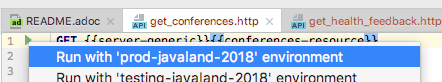

:filename: dukecon/samples/README.adoc
= Test HTTP/REST requests

If you want to test DukeCon endpoints in different environments, i.e.., on _localhost_, on one of the _staging_
environments, or even one of the _production_ environments, you will find some executable tests and environment
definitions here.

== Test execution

These tests can be directly executed in IntelliJ. The IDE provides build in REST or HTTP client. The Client will allow
to execute one of the test cases directly and choose one of the environments defined in link:rest-client.env.json[].

This will run the test:

[source,text]
----
GET https://programm.javaland.eu/info/server

HTTP/1.1 200
Date: Thu, 10 May 2018 20:07:21 GMT
Server: Apache/2.4.29 (Unix)
X-Application-Context: application:javaland-production,postgresql,docker:8080
ETag: "059722d7d47b1f042ee889f5534f671eb"
Content-Type: application/vnd.spring-boot.actuator.v1+json;charset=UTF-8
Content-Length: 92
P3P: CP="Potato"
Via: 1.1 programm.javaland.eu
Keep-Alive: timeout=15, max=100
Connection: Keep-Alive

{"git":{"commit":{"time":"2018-05-10T15:45:39.000+0000","id":"03a9a38"},"branch":"develop"}}

Response code: 200; Time: 335ms; Content length: 92 bytes
----

== Test cases

`get_conferences`:: Get a list of provided conferences.
`get_health_feedback`:: Get health status of DukeCon feedback server.
`get_health_server`:: Get health status of the (generic) DukeCon server.
`get_info_feedback`:: Get build info of DukeCon feedback server.
`get_info_server`:: Get build info of the (generic) DukeCon server.
`get_init`:: Get the `init.json` of the conference.
`get_keycloak`:: Get the `keycloak.json` of the conference.
